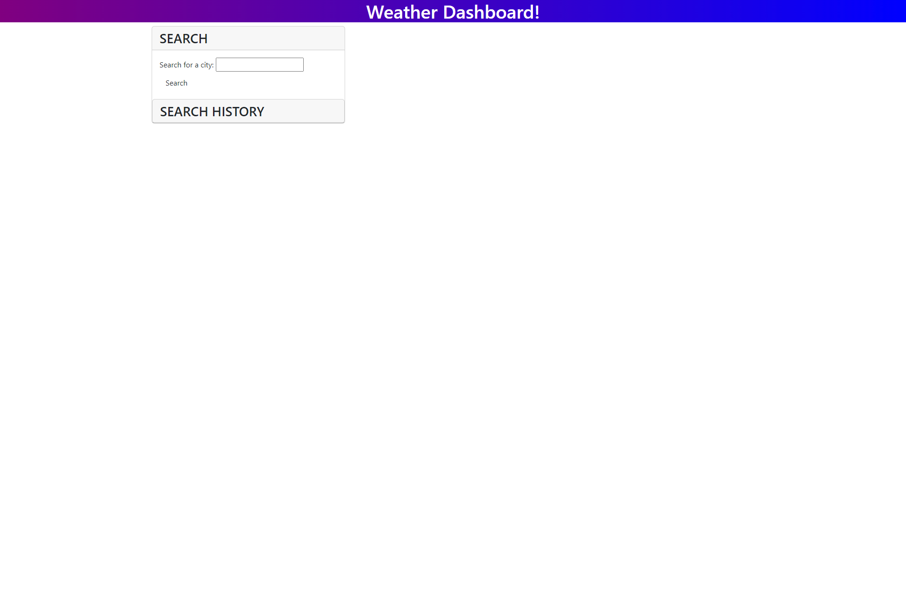
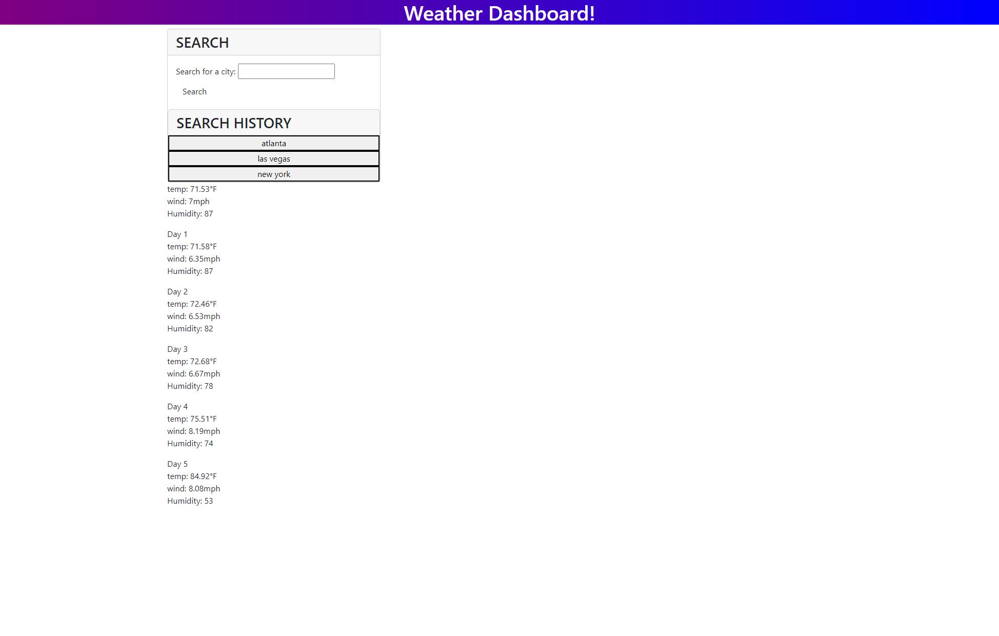

# City-Weather-Forecast

This contains the Module 6 Challenge
## Description
- The goal of this project was to create a webpage that would allow users to get weather data for cities.
- Users can input city names and get the current weather, five day forecast, and a list of their searches

## Usage

- to use this site enter a city into the searchbar then press enter or the search button
- from there the info will be printed
- to see data from a previous search, simply press the button with the name of the previous city

## Screenshot

